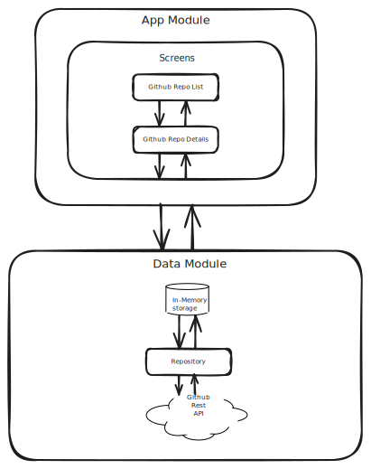

# GitHubRepos

## Description
A GitHub client that showcases public repositories ranked by their star count, along with detailed contributor information. Easily identify the top contributor for each project.

## Table of Contents

- [Sample Demo](#sample-demo)
- [Features](#features)
- [Tech Stack](#tech-stack)
- [Architecture (MVVM)](#architecture)
- [Setup And Installation](#setup-and-installation)
- [Potential Improvements](#potential-improvements)

## Sample Demo

<picture>
  <source media="(prefers-color-scheme: dark)" srcset="docs/images/githubrepos-dark.gif" />
  <source media="(prefers-color-scheme: light)" srcset="docs/images/githubrepos-light.gif" />
  
</picture>

## Features
* Displays a list of GitHub repositories featuring:
    * Repository owner's avatar
    * Repository name and description
    * Star count
    * Top contributor's avatar, username, and commit count
* Fetches data asynchronously using Kotlin Coroutines and Flow.
* Tapping a repository navigates to a detail screen.
* Smooth screen transitions using Jetpack Compose Animation.
* Detail screen shows:
    * Repository details (name, owner, stars, description, link).
    * A horizontal list of the top 10 contributors (avatar, username, commit count).
* An "About" dialog displaying the app's logo, name, version, and description.
* Handles loading and error states gracefully.
* Uses a modern tech stack including:
  * Jetpack Compose for UI,
  * Retrofit for networking, 
  * And follows the MVVM architecture pattern.

## Tech Stack

* **Language:** [Kotlin](https://kotlinlang.org/)
* **UI Toolkit:** [Jetpack Compose](https://developer.android.com/jetpack/compose)
* **Architecture:** [MVVM (Model-View-ViewModel)](https://developer.android.com/jetpack/guide)
* **Asynchronous Programming:** [Kotlin Coroutines](https://kotlinlang.org/docs/coroutines-overview.html) & [Flow](https://kotlinlang.org/docs/flow.html)
* **Networking:** [Retrofit 2](https://square.github.io/retrofit/) & [OkHttp 3](https://square.github.io/okhttp/)
* **JSON Parsing:** [Kotlin Serialization](https://github.com/Kotlin/kotlinx.serialization)
* **Image Loading:** [Coil](https://coil-kt.github.io/coil/)
* **Navigation:** [Jetpack Navigation Compose](https://developer.android.com/jetpack/compose/navigation)
* **Lifecycle Management:** [AndroidX Lifecycle (ViewModel, LifecycleScope, collectAsStateWithLifecycle)](https://developer.android.com/jetpack/androidx/releases/lifecycle)
* **Material Design:** [Material Design 3](https://m3.material.io/)
* **Testing:** [JUnit 5](https://junit.org/junit5/)
* **Dependency Injection:** [Hilt](https://developer.android.com/training/dependency-injection/hilt-android)
* **Build Tool:** [Gradle](https://gradle.org/)
* **Third Party Libraries:** Lot's of them

## Architecture (MVVM)

The application follows the Model-View-ViewModel (MVVM) architectural pattern:

* **Model:** Represents the data layer. It includes:
    * Data classes (`GithubRepo`, `Contributor`, `Owner`) representing the structure of data from the GitHub API.
    * Network layer (`GithubApiService`) responsible for making API calls.
    * Repository (`GithubRepository`) that abstracts the data source (network API and in-memory API) and provides clean data using Kotlin Flow to the ViewModels. It handles fetching and caching data in memory.
* **View:** The UI layer, built entirely with Jetpack Compose.
    * Composable functions (`GithubRepoListScreen`, `GithubRepoDetailScreen`, `AboutDialog`, etc.) display the UI based on the state exposed by the ViewModel.
    * Observes state changes from the ViewModel using `collectAsStateWithLifecycle` and `collectAsLazyPagingItems` for paging data.
    * Navigation is handled using `NavHostController` and a defined navigation graph (`AppNavGraph`).
* **ViewModel:** Acts as a bridge between the View and the Model (Repository).
    * Holds and manages UI-related state (`GithubRepoDetailUiState`, `PagingData<GithubRepo>`) using `StateFlow`.
    * Contains business logic to fetch data from the Repository using `viewModelScope`.
    * Exposes state to the View.
    * Survives configuration changes.



## Setup and Installation

1.  **Clone the repository:**
    ```bash
    git clone [https://github.com/your-username/github-repos.git](https://github.com/eyedol/github-repos.git)
    cd github-repos
    ```
2.  **Open in Android Studio:** Open the cloned project directory in Android Studio.
3.  **Sync Gradle:** Let Android Studio sync the project and download dependencies.
4.  **(Optional but Recommended) GitHub API Token:**
    * The GitHub API has rate limits for unauthenticated requests. 
    * Add the token to the `local.properties` file. Entry should be:
      * `GITHUB_API_KEY=<github_pat_11AAAR...>` 
5.  **Build and Run:** Select a device or emulator and run the app.

## Potential Improvements

* **Search Functionality:** Add a search bar to allow users to search for specific repositories.
* **Enhance Data Loading:** Separately fetch contributor data for each repository.
* **Error Handling:** More granular error handling and user feedback (e.g., specific messages for network vs. API errors).
* **Offline Caching:** Implement caching using Room to show data when offline.
* **Testing:** Add UI tests for Composable screens.
* **UI Enhancements:** Improve UI/UX add more animations.
* **App Icon:** Design a good looking app icon.
